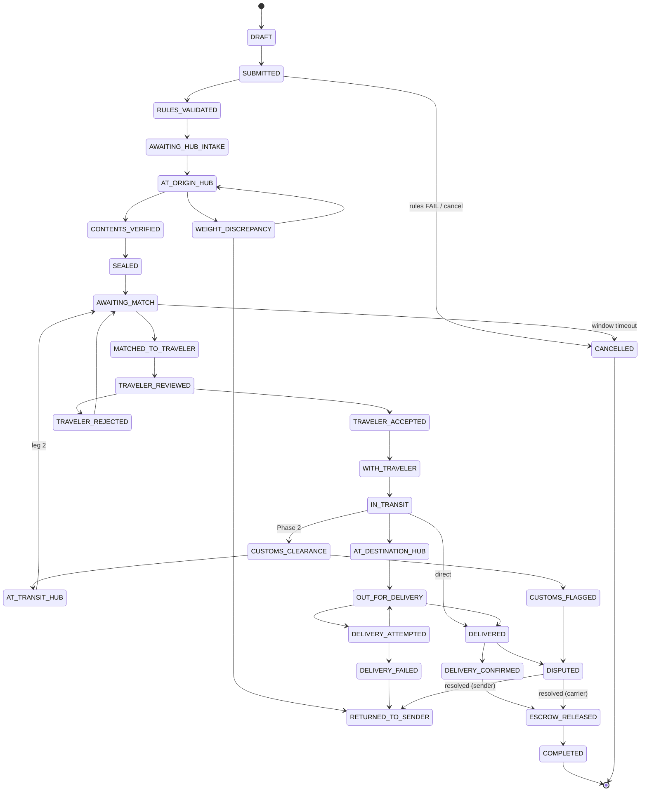

# SHANTA — Shipment State Machine

> The lifecycle of a `Shipment` (and its `ShipmentLeg`s) from draft to completion, including
> the verification/sealing states that implement Constraint 2.2 and the exception states for
> every edge case that *will* happen in Phase 1. Implemented as a `status` enum + optimistic
> `version` (not event sourcing — see [CLAUDE.md](../CLAUDE.md)), with every transition written
> to `ShipmentStatusHistory` and `AuditLog`. Run `/shanta-state` for the table view.

## Design decisions

- **Status field, not event sourcing.** Evaluated and rejected event sourcing for Phase 1: more
  complexity, harder "all shipments in state X" queries. The audit-trail requirement it would serve
  is met by `ShipmentStatusHistory` (append-only per-shipment) + `AuditLog` (immutable, all actors).
- **Optimistic concurrency.** Every transition is `UPDATE … WHERE id=? AND status=? AND version=?`.
  If the row count is 0, another actor transitioned concurrently → **409 Conflict**, no corruption.
- **Multi-hop ready.** Per-hop movement lives on `ShipmentLeg`; the `Shipment.status` reflects the
  overall journey. Phase 1 (domestic, often single-leg) uses a subset; Phase 2 (Addis transit,
  Constraint 2.3) uses the full set **without restructuring**.
- **Verification & sealing are named states**, not notes (Constraint 2.2): `CONTENTS_VERIFIED`,
  `SEALED`, `TRAVELER_REVIEWED`, `TRAVELER_ACCEPTED`/`TRAVELER_REJECTED`.
- **Rejection is normal, not an error.** `TRAVELER_REJECTED` is an expected state (Riskiest
  Assumption 3) — rejected items re-enter matching.

---

## State Definitions

| State | Owner (actor) | Meaning for the physical item |
|---|---|---|
| `DRAFT` | Sender | Being created; not submitted. No custody. |
| `SUBMITTED` | Sender | Sender confirmed; awaiting rules validation. Idempotency-keyed. |
| `RULES_VALIDATED` | System | Passed rules engine at submission (Constraint 2.4). |
| `AWAITING_HUB_INTAKE` | Sender→Hub | Sender must bring item to origin hub. |
| `AT_ORIGIN_HUB` | Aggregator | Item physically received at origin hub; weighed. |
| `CONTENTS_VERIFIED` | Aggregator | Hub operator photographed + inspected contents (2.2). |
| `SEALED` | Aggregator | Tamper seal applied **after** verification (2.2). |
| `AWAITING_MATCH` | System/Hub | In matching queue for a traveler on the corridor. |
| `MATCHED_TO_TRAVELER` | Hub | A traveler+TripLeg assigned (crowding constraint checked). |
| `TRAVELER_REVIEWED` | Traveler | Traveler has viewed contents/photos at handoff. |
| `TRAVELER_ACCEPTED` | Traveler | Traveler acknowledged "inspected, matches description" (2.2). |
| `TRAVELER_REJECTED` | Traveler | Traveler declined after review — **normal**; re-enters matching. |
| `WITH_TRAVELER` | Traveler | Custody transferred to traveler; leg ready to depart. |
| `IN_TRANSIT` | Traveler | Traveler en route on a leg. |
| `CUSTOMS_CLEARANCE` | Traveler | *(Phase 2)* Clearing customs (e.g., Addis, Constraint 2.3). |
| `AT_TRANSIT_HUB` | Aggregator | *(Phase 2)* At an intermediate hub between legs (Addis). |
| `AT_DESTINATION_HUB` | Aggregator | Arrived at destination hub; awaiting delivery. |
| `OUT_FOR_DELIVERY` | Traveler/Hub | En route to receiver (or receiver pickup arranged). |
| `DELIVERY_ATTEMPTED` | Traveler/Hub | Receiver unavailable; awaiting retry/escalation. |
| `DELIVERED` | Traveler/Hub | Physically handed to receiver; awaiting confirmation. |
| `DELIVERY_CONFIRMED` | Receiver | Receiver confirmed (live photo / SMS code). Clean. |
| `ESCROW_RELEASED` | Admin/System | Payment released to carrier/aggregator (manual Phase 1). |
| `COMPLETED` | System | Terminal success. |

### Exception / edge-case states

| State | Trigger | Meaning |
|---|---|---|
| `WEIGHT_DISCREPANCY` | Hub intake weight ≠ declared (Edge 9) | Price/rules re-check needed before proceeding. |
| `CUSTOMS_FLAGGED` | Customs hold/seizure (Edge 3) | Item held/seized by authorities. Escrow frozen. |
| `DISPUTED` | Broken seal / theft claim / mismatch (Edge 4) | Under dispute. Escrow must **not** release. |
| `ON_HOLD` | Admin pause / hub offline (Edge 6) | Frozen pending operational resolution. |
| `DELIVERY_FAILED` | Retries exhausted after `DELIVERY_ATTEMPTED` (Edge 5) | Could not deliver; escalate to hub/return. |
| `RETURNED_TO_SENDER` | Cancellation/failure return path (Edge 1,8) | Item returned; partial fees may apply. |
| `CANCELLED` | Sender/admin cancel (Edge 8,10) | Terminated before delivery. Terminal. |

---

## Transition Table

`FROM → TO | Trigger | Actor | Verification Required | What is Recorded`

| From → To | Trigger | Actor | Verification | Recorded |
|---|---|---|---|---|
| DRAFT → SUBMITTED | Sender submits | Sender | Idempotency-Key; required fields | StatusHistory; RestrictionCheck queued |
| SUBMITTED → RULES_VALIDATED | Rules engine pass | System | Rules engine (SUBMISSION trigger) | RestrictionCheck(PASS) |
| SUBMITTED → CANCELLED | Rules FAIL (prohibited) or sender cancels | System/Sender | RestrictionCheck(FAIL) | RestrictionCheck(FAIL); reason |
| RULES_VALIDATED → AWAITING_HUB_INTAKE | Pricing + escrow created | System | Pricing snapshot; EscrowRecord PENDING | pricing_snapshot; Escrow PENDING |
| AWAITING_HUB_INTAKE → AT_ORIGIN_HUB | Hub receives item | Aggregator | Intake photo; weigh | HandoffRecord(SENDER_TO_HUB); actual_weight_kg |
| AT_ORIGIN_HUB → WEIGHT_DISCREPANCY | actual ≠ declared (threshold) | System | Weight comparison | StatusHistory; note |
| WEIGHT_DISCREPANCY → AT_ORIGIN_HUB | Sender accepts revised price/rules re-pass | Sender/System | Re-price; re-run rules | RestrictionCheck; new pricing_snapshot |
| WEIGHT_DISCREPANCY → RETURNED_TO_SENDER | Sender rejects / rules now fail | Sender/System | — | StatusHistory; reason |
| AT_ORIGIN_HUB → CONTENTS_VERIFIED | Operator inspects + photographs | Aggregator | **≥1 contents photo; operator inspection** | HandoffRecord(photos, acknowledged by hub) |
| CONTENTS_VERIFIED → SEALED | Operator applies tamper seal | Aggregator | **Seal applied AFTER verification**; seal_id | HandoffRecord(seal_applied, seal_id) |
| SEALED → AWAITING_MATCH | Enter matching queue | System | — | StatusHistory |
| AWAITING_MATCH → MATCHED_TO_TRAVELER | Operator matches traveler | Aggregator | Matching query incl. crowding + 2.1 | ShipmentLeg(trip_leg_id, traveler_id) |
| MATCHED_TO_TRAVELER → TRAVELER_REVIEWED | Traveler views contents at handoff | Traveler | Show contents photos / open package per protocol | HandoffRecord(HUB_TO_TRAVELER, reviewed) |
| TRAVELER_REVIEWED → TRAVELER_ACCEPTED | Traveler acknowledges | Traveler | **Acknowledgment: "inspected, matches description"** | HandoffRecord(acknowledged=true, ack copy) |
| TRAVELER_REVIEWED → TRAVELER_REJECTED | Traveler declines | Traveler | — (normal) | StatusHistory; reason |
| TRAVELER_REJECTED → AWAITING_MATCH | Re-queue for another traveler | System | Release TripLeg capacity | ShipmentLeg reset |
| TRAVELER_ACCEPTED → WITH_TRAVELER | Custody transfer complete | Traveler/Hub | Seal intact check | HandoffRecord; capacity decremented |
| WITH_TRAVELER → IN_TRANSIT | Leg departs | Traveler | — | StatusHistory |
| IN_TRANSIT → CUSTOMS_CLEARANCE | *(P2)* Reaches customs (Addis) | Traveler | — | StatusHistory |
| CUSTOMS_CLEARANCE → AT_TRANSIT_HUB | *(P2)* Cleared; to transit hub | Traveler/Aggregator | HandoffRecord(TRAVELER_TO_HUB) | HandoffRecord |
| CUSTOMS_CLEARANCE → CUSTOMS_FLAGGED | Held/seized | Authority | — | StatusHistory; Escrow frozen; alert |
| AT_TRANSIT_HUB → AWAITING_MATCH | *(P2)* Match next-leg traveler | Aggregator | Matching query (leg 2) | new ShipmentLeg |
| IN_TRANSIT → AT_DESTINATION_HUB | Arrives at destination hub | Traveler/Aggregator | HandoffRecord(TRAVELER_TO_HUB); seal intact | HandoffRecord(seal_intact) |
| IN_TRANSIT → DELIVERED | Direct traveler→receiver (no dest hub) | Traveler | Live delivery photo | HandoffRecord(TRAVELER_TO_RECEIVER) |
| AT_DESTINATION_HUB → OUT_FOR_DELIVERY | Dispatch / pickup arranged | Aggregator | — | StatusHistory |
| OUT_FOR_DELIVERY → DELIVERED | Handed to receiver | Traveler/Hub | **Live-capture photo (no gallery); geo/timestamp** | HandoffRecord(LIVE, geo) |
| OUT_FOR_DELIVERY → DELIVERY_ATTEMPTED | Receiver unavailable | Traveler/Hub | — | StatusHistory; notify receiver |
| DELIVERY_ATTEMPTED → OUT_FOR_DELIVERY | Retry within window | Traveler/Hub | — | StatusHistory |
| DELIVERY_ATTEMPTED → DELIVERY_FAILED | Retries exhausted | System | — | StatusHistory; escalate |
| DELIVERY_FAILED → RETURNED_TO_SENDER | Return path | Aggregator | HandoffRecord | StatusHistory |
| DELIVERED → DELIVERY_CONFIRMED | Receiver confirms | Receiver | Live photo OR SMS confirmation code; seal intact | HandoffRecord; confirmation |
| DELIVERED → DISPUTED | Receiver reports broken seal / wrong contents | Receiver | Seal_intact=false / mismatch evidence | StatusHistory; Escrow held |
| DELIVERY_CONFIRMED → ESCROW_RELEASED | Clean confirmation, no dispute | Admin/System | Escrow release_condition met | Escrow RELEASED; AuditLog |
| ESCROW_RELEASED → COMPLETED | Finalize | System | — | StatusHistory |
| DISPUTED → ESCROW_RELEASED | Dispute resolved in carrier favor | Admin | Evidence review (RUNBOOK) | OperationalNote; Escrow RELEASED |
| DISPUTED → REFUNDED/RETURNED_TO_SENDER | Dispute resolved in sender favor | Admin | Evidence review | Escrow REFUNDED |
| (many) → ON_HOLD | Admin pause / hub offline | Admin/System | — | StatusHistory; reason |
| ON_HOLD → (prior state) | Resolved | Admin | — | StatusHistory |
| (pre-WITH_TRAVELER) → CANCELLED | Sender/admin cancel | Sender/Admin | Cancellation policy/fee | StatusHistory; Escrow REFUNDED |
| (post-intake cancel) → RETURNED_TO_SENDER | Cancel after hub possession (Edge 8) | Sender/Admin | Return fee applied | HandoffRecord; partial fees |
| CUSTOMS_FLAGGED → DISPUTED/RETURNED/CANCELLED | Resolution per RUNBOOK (Edge 3) | Admin | Authority outcome | OperationalNote |

> Every transition also writes `AuditLog(action="shipment.state.transition", before, after)` and
> increments `version`. A transition that doesn't write history is a bug.

---

## Invalid Transitions (must be blocked)

These are illegal and must be rejected at the service layer (and ideally a DB check):

- `DELIVERED → SUBMITTED` (no going back to the start of the lifecycle).
- `SEALED → CONTENTS_VERIFIED` — **sealing follows verification; never the reverse** (Constraint 2.2).
- `AT_ORIGIN_HUB → SEALED` — cannot seal before `CONTENTS_VERIFIED` (no inspection skipping).
- `MATCHED_TO_TRAVELER → WITH_TRAVELER` — cannot skip `TRAVELER_REVIEWED`/`TRAVELER_ACCEPTED`
  (the traveler **must** review + acknowledge before custody — Constraint 2.2).
- `DISPUTED → ESCROW_RELEASED` **without admin review** — no auto-release on a disputed shipment.
- `DELIVERED → ESCROW_RELEASED` directly — must pass through `DELIVERY_CONFIRMED` (receiver confirms).
- `* → COMPLETED` from anything except `ESCROW_RELEASED`.
- `CANCELLED → *` and `COMPLETED → *` — terminal states have no outgoing transitions.
- Any transition that doesn't match `(expected status, expected version)` → 409 (concurrency).

---

## Content Verification & Sealing (Constraint 2.2 — explicit)

The ordered, mandatory chain (each is a named state + a `HandoffRecord`):

```
AT_ORIGIN_HUB
   │  hub operator opens, inspects, photographs contents (≥1 photo)
   ▼
CONTENTS_VERIFIED          ← evidence captured; contents match declaration
   │  tamper seal applied AFTER inspection; seal_id recorded
   ▼
SEALED                     ← sealing can NEVER precede verification
   │  ... matched ...
   ▼
MATCHED_TO_TRAVELER
   │  traveler is shown contents/photos at handoff
   ▼
TRAVELER_REVIEWED
   │  traveler clicks "I have inspected the contents and they match the declared description"
   ▼               └─ refuse ─► TRAVELER_REJECTED ─► AWAITING_MATCH (re-queue; NORMAL)
TRAVELER_ACCEPTED          ← due-diligence record created; custody may transfer
```

The app must make it **structurally impossible** to reach `CONTENTS_VERIFIED` without a photo, to
reach `SEALED` without verification, or to reach `WITH_TRAVELER` without an acknowledgment.

---

## Compensation / "undo" (Saga thinking — documented, not orchestrated in Phase 1)

For each forward transition, the compensating action (run manually via [RUNBOOK.md](../RUNBOOK.md)
in Phase 1; no orchestrator):

- Match assigned → **un-match**: reset `ShipmentLeg`, restore `TripLeg.available_capacity_kg`,
  back to `AWAITING_MATCH`.
- Custody to traveler → **return to hub**: `HandoffRecord(TRAVELER_TO_HUB)`, back to hub state.
- Escrow held → **refund**: `EscrowRecord.status = REFUNDED` (admin), `RETURNED_TO_SENDER`.
- Flight cancelled mid-leg → un-match that leg, item returns to last hub, re-queue; escrow stays HELD.

---

## Example Flow A — Simple domestic shipment (Addis → Hawassa, single leg, Phase 1)

*Illustrative corridor only; the route is OQ-5, the model is corridor-agnostic.*

1. Sender drafts a 1.5kg "roasted coffee, gift" shipment, Addis → Hawassa → **DRAFT**.
2. Sender submits (Idempotency-Key) → **SUBMITTED**. Rules engine runs: coffee ≤ 2kg exit → PASS →
   **RULES_VALIDATED**. Pricing snapshot + EscrowRecord(PENDING, holder=HUB) → **AWAITING_HUB_INTAKE**.
3. Sender drops at Addis origin hub. Operator weighs (1.5kg ✓), photographs intake →
   `HandoffRecord(SENDER_TO_HUB)` → **AT_ORIGIN_HUB**.
4. Operator opens, inspects, photographs contents → **CONTENTS_VERIFIED**; applies seal `SEAL-00123`
   → **SEALED** → **AWAITING_MATCH**.
5. Operator runs the matching query: finds a casual traveler flying/driving Addis→Hawassa tomorrow
   with capacity, low 90-day frequency, no coffee crowding → **MATCHED_TO_TRAVELER**.
6. At handoff, traveler is shown the contents photos → **TRAVELER_REVIEWED**; clicks the
   acknowledgment → **TRAVELER_ACCEPTED**. Seal intact → custody → **WITH_TRAVELER**. Escrow → HELD.
7. Traveler departs → **IN_TRANSIT**. Arrives, hands directly to receiver with a live delivery photo
   → **DELIVERED**. (No destination hub on this simple route.)
8. Receiver gets an SMS with a confirmation code, confirms (seal intact) → **DELIVERY_CONFIRMED**.
9. Admin releases escrow to carrier (+ aggregator fee) → **ESCROW_RELEASED** → **COMPLETED**.

## Example Flow B — Diaspora multi-hop (International origin → Addis customs → Mekelle, Phase 2)

*Shows the full multi-hop machine and Constraint 2.3. Built in Phase 2; designed now.*

1. Diaspora sender (abroad) drafts, submits → rules engine validates for the international corridor
   (stricter rules; OQ-3) → **RULES_VALIDATED** → **AWAITING_HUB_INTAKE** at the origin-country hub.
2. Origin hub intake, verify, seal → **SEALED** → match **leg 1** traveler (international→Addis) →
   accept → **WITH_TRAVELER** → **IN_TRANSIT**.
3. Arrives Addis → **CUSTOMS_CLEARANCE** (Constraint 2.3 — passenger must clear customs and collect
   baggage). Two branches:
   - Cleared → `HandoffRecord(TRAVELER_TO_HUB)` at Addis transit hub → **AT_TRANSIT_HUB**.
   - Held/seized → **CUSTOMS_FLAGGED** → escrow frozen → admin protocol (RUNBOOK §9).
4. At Addis transit hub → **AWAITING_MATCH** for **leg 2** (Addis→Mekelle). A *different* traveler is
   matched (new `ShipmentLeg`, seq 2) → review + accept → **WITH_TRAVELER** → **IN_TRANSIT**.
   - *Edge 2 (missed connection):* traveler stuck in Addis → un-match leg 2, item stays at transit
     hub, re-queue; escrow stays HELD; sender notified.
5. Arrives Mekelle hub → **AT_DESTINATION_HUB** → **OUT_FOR_DELIVERY** → **DELIVERED** →
   **DELIVERY_CONFIRMED** → **ESCROW_RELEASED** → **COMPLETED**.

---

## All 10 edge cases → states (each handled, none "later")

| # | Edge case | State(s) / path |
|---|---|---|
| 1 | Flight cancelled after acceptance | WITH_TRAVELER → (un-match) → AWAITING_MATCH; escrow HELD; or RETURNED_TO_SENDER |
| 2 | Missed connection in Addis | AT_TRANSIT_HUB → AWAITING_MATCH (leg 2 re-match); escrow HELD |
| 3 | Customs seizure | → CUSTOMS_FLAGGED → admin → DISPUTED/RETURNED/CANCELLED (RUNBOOK §9) |
| 4 | Broken tamper seal at delivery | DELIVERED → DISPUTED (escrow NOT released) before any DELIVERY_CONFIRMED |
| 5 | Receiver not available | OUT_FOR_DELIVERY → DELIVERY_ATTEMPTED → (retry) → DELIVERY_FAILED → escalate |
| 6 | Hub closure / aggregator offline | → ON_HOLD; admin reassigns custody (RUNBOOK §3) |
| 7 | Duplicate submission | Blocked at SUBMITTED via Idempotency-Key (unique sender+key) |
| 8 | Sender cancels after intake | → RETURNED_TO_SENDER with return fee; escrow REFUNDED minus fee |
| 9 | Weight discrepancy at hub | AT_ORIGIN_HUB → WEIGHT_DISCREPANCY → re-price/re-rules → AT_ORIGIN_HUB or RETURNED_TO_SENDER |
| 10 | Matching window timeout | AWAITING_MATCH → (timeout) → notify sender → CANCELLED or manual commercial-freight fallback |

---

## State Machine Diagram (Mermaid)


